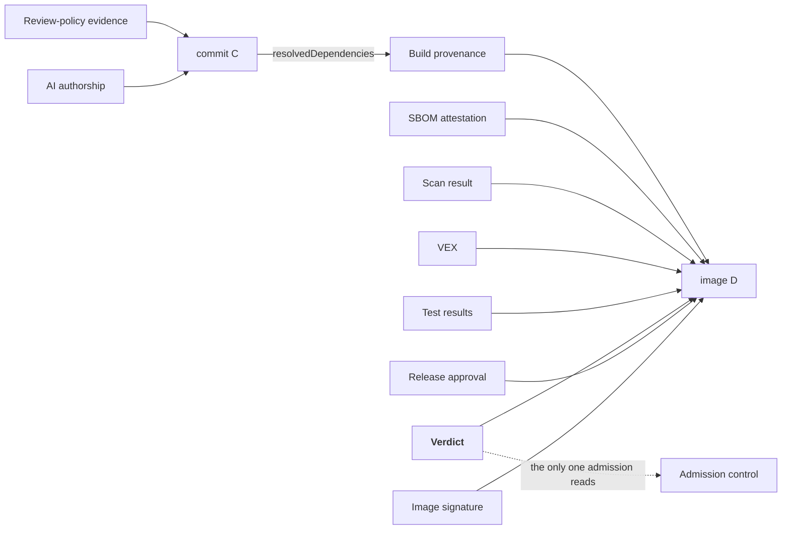

# A Change, End to End

A vulnerability is reported in a library used by `payments-api`. Someone has to fix it, and the fix has to reach production with evidence an assessor could check two years later.

Throughout: **D** is the final image digest, **C** is the git commit.

---

## 1. The advisory arrives

A new CVE lands in the vulnerability database. A scheduled scan of what is *already running* flags `payments-api` as affected.

**The scan is of the running system, not of a build.** The surviving US federal obligation after the 2026 deregulation is "an SBOM of the **runtime production environment** upon request" -- so this scan is the compliance artefact, not the build-time one. Runtime SBOM assembly is thinly served rather than empty: a Kubernetes operator for the *Deployed* type exists at a few hundred stars, and the evidence for anything beyond it is a **weak negative on a narrow search** rather than a confirmed absence. Treat it as a gap to size properly, not a gap to claim.

**The finding is probably wrong.** Registry telemetry: 65% of open-source CVEs lack a severity score in the national database, and independent severity assessments agree with it only **55.7%** of the time. Matching on vendor-product identifiers against open-ended version ranges is the dominant source of false positives, and false positives are what get gates switched off.

So the first real step is not fixing anything.

## 2. Triage, and the question that actually matters

Is the vulnerable code **reachable** from this application?

Three outcomes, and only one of them is work:

| Verdict | Action | Artefact |
|---|---|---|
| Not present | Record and move on | Signed VEX: `vulnerable_code_not_present` |
| Present, not reachable | Record and move on | Signed VEX: `vulnerable_code_not_in_execute_path` |
| Reachable | Fix it | Proceed to step 3 |

This is where most factories fail, and the failure is social rather than technical. If recording "not reachable" takes a ticket and a security review, nobody does it, findings accumulate, and the gate gets disabled or blanket-waived within a quarter.

!!! note "A tool exists for this, and it contains no AI -- but read the version number"
    An existing open-source tool turns a maintainer typing a single structured comment into a **Sigstore-signed in-toto VEX attestation**, authorised against a code-owners file. Thirty seconds of human effort produces a durable, verifiable statement.

    It's coupled to one forge by default, but through pluggable interfaces, so porting it is bounded work against a designed seam.

    It does not, however, remove the signed-VEX work from the build list. The tool is at **10 stars, v0.0.1, one maintainer, and its own README calls it experimental.** The *design* is the thing worth adopting; the implementation is a prototype you would end up owning. Treat it as a head start, not a dependency.

    A model should *not* make this call either way: the best measured performance on selecting the right VEX justification is under 70%.

A caveat: **52.9% of 78,000 real-world SBOMs declare no dependency edges at all.** Reachability analysis over a graph with no edges silently returns "not reachable" for everything. Detecting that degenerate case moved recall on known-exploited vulnerabilities from 0.60 to 0.95 -- a cheap mechanical check with a very large effect.

## 3. The fix gets written

An agent is given the ticket, the SBOM, the reachability verdict and the advisory. It proposes a dependency bump and adjusts two call sites.

Of 36,870 real upgrade recommendations analysed, **27.76% referenced versions that do not exist**. An agent working from the resolved dependency graph rather than from memory doesn't make that mistake -- which is the practical case for the factory's evidence being *queryable*, not merely attached.

What the agent may and may not do comes from the [capability descriptor](../how/primitives.md#3-the-capability-descriptor). In this tier, `single-file-change` and `test-gen` are enabled. If this had been a sprawling refactor, the descriptor would have refused it and the work would have been decomposed.

**The agent never holds a push credential.** It proposes; a separate non-model process performs the privileged action after a gate. This is structural, not a policy -- an agent with repository access, untrusted input and network egress can be induced to exfiltrate, and prompt engineering is not a defence.

## 4. Mechanical checks the human cannot perform

Before review, deterministic checks run on the diff:

- **Unicode normalisation and invisible-character detection.** Not optional. A real worm used Unicode variation selectors that render as blank lines -- invisible in every diff view, executable to the interpreter -- and reached a major marketplace.
- **Licence and snippet scanning**, because model output can carry training-data-derived code.
- **Secret scanning.**
- Build, test, lint.

## 5. Review, and the only legally meaningful signature

A human reads the diff and signs off.

Two rules, and the first is law rather than preference:

!!! danger "An agent may never sign off on its own work"
    Only a human can certify the Developer Certificate of Origin. The kernel's policy states it plainly, and it is the right rule: *"You are expected to understand and to be able to defend everything you submit."*

The commit carries an `Assisted-by:` trailer naming the tools. Scrutiny is proportional to how much was generated.

**What this transition produces** is the thing nothing in open source currently emits: an attestation that the review policy was met for commit **C**, carrying what was checked mechanically, who accepted the remainder, the model identity and the capability-descriptor digest. See [the empty slots](../how/slots.md#the-24-slots-and-where-the-gaps-are).

## 6. The build

An ephemeral executor, provisioned fresh. Dependencies prefetched and hash-verified *before* the network is cut, then the build runs with no network access.

Two things fall out of this:

**Hermeticity is a lock-file discipline problem, not a sandboxing problem.** If every dependency is pinned with a digest in a lock file the prefetcher understands, hermeticity is a flag. If the build fetches a tarball from a URL mid-compile, it's a project.

**Hermeticity and SBOM quality are the same problem wearing two hats.** A hermetic build with a prefetch step has already produced a complete, hash-verified dependency list -- which is a build-time SBOM with real hashes, rather than a post-hoc guess.

!!! note "A widely believed thing that is false"
    Hermeticity is **not** required for SLSA Build Level 3. The specification says so explicitly. L3 demands isolation and ephemerality. Conflating the two is how teams conclude L3 is unreachable and stop trying.

    The genuinely hard L3 requirement is the sleeper: **cache poisoning must be impossible** -- the output must be identical whether or not the cache is used. Most CI caches key on a tenant-supplied cache key and are therefore poisonable. Fixing that is a platform rewrite.

## 7. Evidence production

The build emits, all bound to **D** by digest, all wrapped in the same envelope:

| Document | Signed by |
|---|---|
| Build provenance | Build platform key (unreachable from build steps) |
| Build-time SBOM | Build platform key |
| Vulnerability scan result | Scanner identity |
| Test results | Test task identity |
| The step-2 VEX | VEX-issuer identity |

**The SBOM must be signed**, and an author signature is now a baseline element in the current minimum-elements guidance. The most mature open factory ships its *build-time* SBOM unsigned but does cryptographically sign its *release-time* one, so the gap is a narrow one and signing a build-time SBOM is **not** a cheap differentiator.

## 8. The gate

Now the expensive reasoning happens, once:

- every document binds to **D**
- each signer is the expected signer for that document type
- external build parameters are **allowlisted**, not denylisted
- **the build only ran approved tasks** -- the highest-value rule in the set, and the one most factories omit
- scan findings are either below threshold or covered by a verified VEX statement from an authorised issuer

The gate signs a **verdict** recording the digest of the policy that produced it, and the model identity and capability-descriptor digest from step 3.

!!! tip "Waivers that expire by construction"
    Every real gate needs break-glass. The good implementations make exclusions carry `effectiveOn` and `effectiveUntil` dates, a link to a tracking issue, and warnings before expiry.

    The alternative is measured: suppressions grow **monotonically**, **50.8% suppress nothing at all**, and dead suppressions **silently mask future findings**.

## 9. Signing and promotion

The release authority signs a release approval, and signs the image. All ten documents -- build provenance, build-time SBOM, scan result, VEX, test results, review-policy evidence, AI authorship, the verdict, the release approval and the image signature -- are attached in the registry as referrers, discoverable by querying the digest.

**Hard registry requirement:** the referrers API must be supported. The fallback tag scheme is race-prone by the specification's own admission, and two concurrent attestation pushes will silently lose one.

## 10. Deployment

GitOps reconciles the new digest. Admission control verifies **a signature and the verdict**. Nothing else.

That is the entire runtime check -- cheap, local, unbypassable, inside a webhook's time budget. Everything upstream existed to make this one check meaningful.

## 11. The loop closes

The running-system inventory updates. The next scheduled scan sees the new version. If a future advisory affects it, step 1 begins again with current data.

---

## What exists at the end

Ten signed documents by six distinct identities -- eight bound to the image digest **D**, and two (review-policy evidence and AI authorship) bound to the commit **C**, because that is what they are statements about:

## Four things this flow makes obvious

**Admission control reads one document.** Everything else exists to justify it. If admission is doing expensive work, the design failed upstream.

**Six identities, not one.** If a single key signed all of this, the verdict would be worthless -- a compromised build could issue its own pass.

**The expensive step is step 2, and it is social.** Triage, not fixing. A factory where recording a VEX justification is one comment keeps its gate. One where it costs a ticket and a security review loses the gate within a quarter.

**The scarce resource is reviewer attention.** Generation is cheap and getting cheaper. So the highest-value thing the factory produces isn't the artefact; it's the evidence that makes step 5 quick: a passing test suite that actually covers the diff, a reachability verdict, a statement that this change touches nothing else.

---

**Next:** [The Same Change, Air-Gapped](airgap.md) -- the same eleven steps, with two of them broken and a third that only looks it.
