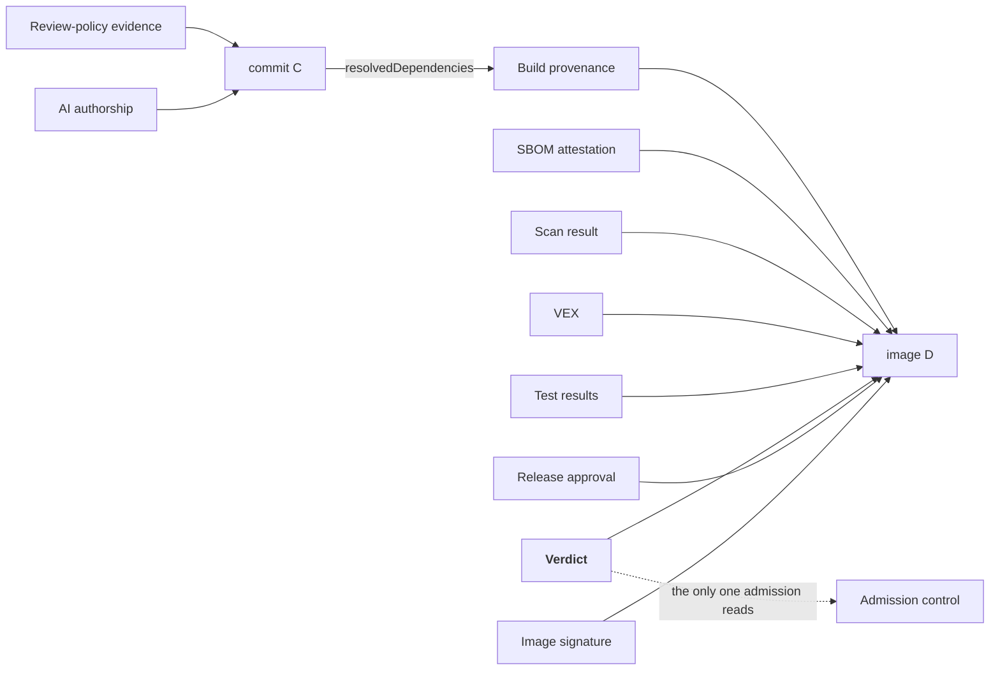

# A Change, End to End

A vulnerability is reported in a library used by `payments-api`. Someone has to fix it, and the fix has to reach production with evidence an assessor could check two years later.

Throughout: **D** is the final image digest, **C** is the git commit.

---

## 1. The advisory arrives

A new CVE lands in the vulnerability database. A scheduled scan of what is *already running* flags `payments-api` as affected.

**The scan covers the running system.** The surviving US federal obligation after the 2026 deregulation is "an SBOM of the **runtime production environment** upon request" -- so this scan is the compliance artefact that satisfies it. Runtime SBOM assembly looks thinly served: a Kubernetes operator for the *Deployed* type exists at a few hundred stars, and past that all I have is a **weak negative on a narrow search**, so I'd call the wider field unsurveyed and the gap possibly smaller than it looks from here.

**The finding is probably wrong.** Registry telemetry: 65% of open-source CVEs lack a severity score in the national database, and independent severity assessments agree with it only **55.7%** of the time. Matching on vendor-product identifiers against open-ended version ranges looks like the dominant source of false positives, and false positives are what get gates switched off.

So the first real step is triage.

## 2. Triage

Is the vulnerable code **reachable** from this application?

Only one outcome is work:

| Verdict | Action | Artefact |
|---|---|---|
| Not present | Record and move on | Signed VEX: `vulnerable_code_not_present` |
| Present, unreachable | Record and move on | Signed VEX: `vulnerable_code_not_in_execute_path` |
| Reachable | Fix it | Proceed to step 3 |

This is where I think most factories fail, and the reason looks social to me. If recording "not reachable" takes a ticket and a security review, it doesn't get recorded, and findings accumulate until someone disables the gate or waives it wholesale.

!!! note "A tool exists for this, with no model in the loop -- check its version number"
    An existing open-source tool turns a maintainer typing a single structured comment into a **Sigstore-signed in-toto VEX attestation**, authorised against a code-owners file. Thirty seconds of human effort produces a durable, verifiable statement.

    It's coupled to one forge, but through pluggable interfaces, so porting it should be bounded work against a designed seam. I haven't tried the port.

    The signed-VEX work stays on the build list all the same. The tool is at **10 stars, v0.0.1, one maintainer, and its own README calls it experimental.** The *design* is worth adopting; the implementation is a prototype you would end up owning. So the question is whether you want to own that rewrite, or wait and see whether anyone else picks the design up.

    A model should *not* make this call either way: the best performance I've seen measured on selecting the right VEX justification is under 70%.

A caveat: **52.9% of 78,000 real-world SBOMs declare no dependency edges at all.** Reachability analysis over a graph with no edges silently returns "not reachable" for everything. Detecting that degenerate case moved recall on known-exploited vulnerabilities from 0.60 to 0.95. Cheap check, and the size of that jump surprised me.

## 3. The fix gets written

An agent is given the ticket, the SBOM, the reachability verdict and the advisory. It proposes a dependency bump and adjusts two call sites.

Of 36,870 real upgrade recommendations analysed, **27.76% referenced versions that do not exist**. An agent that resolves the dependency graph and reads the real version list is at least choosing from versions that exist. This is where making the factory's evidence *queryable* earns its keep: an attestation sitting in a registry answers no questions at the moment someone needs an answer.

The agent's permitted actions come from the [capability descriptor](../how/primitives.md#3-the-capability-descriptor). In this tier, `single-file-change` and `test-gen` are enabled. If this had been a sprawling refactor, the descriptor would have refused it and the work would have been decomposed.

**The agent never holds a push credential.** It proposes; a separate non-model process performs the privileged action after a gate. The separation is structural -- the credential lives somewhere the agent has no route to. It has to work that way, because an agent with repository access, untrusted input and network egress can be induced to exfiltrate, and prompt engineering is not a defence.

## 4. Mechanical checks the human cannot perform

Before review, deterministic checks run on the diff:

- **Unicode normalisation and invisible-character detection.** Not optional. A real worm used Unicode variation selectors that render as blank lines -- invisible in the diff views I've tried, executable to the interpreter -- and reached a major marketplace.
- **Licence and snippet scanning**, because model output can carry training-data-derived code.
- **Secret scanning.**
- Build, test, lint.

## 5. Review, and the only legally meaningful signature

A human reads the diff and signs off. One rule here is law:

!!! danger "An agent may never sign off on its own work"
    Only a human can certify the Developer Certificate of Origin. The kernel's policy puts it correctly: *"You are expected to understand and to be able to defend everything you submit."*

The commit carries an `Assisted-by:` trailer naming the tools, and scrutiny is proportional to how much was generated.

**What this transition produces** is the piece I haven't found anything in open source emitting: an attestation that the review policy was met for commit **C**, carrying what was checked mechanically, who accepted the remainder, the model identity and the capability-descriptor digest. See [the empty slots](../how/slots.md#the-24-slots-and-where-the-gaps-are).

## 6. The build

An ephemeral executor, provisioned fresh. Dependencies prefetched and hash-verified *before* the network is cut, then the build runs with no network access.

**Hermeticity is a lock-file discipline problem.** If every dependency is pinned with a digest in a lock file the prefetcher understands, hermeticity is a flag; a build that fetches a tarball from a URL mid-compile makes it a project.

**Hermeticity and SBOM quality are the same problem wearing two hats.** A hermetic build with a prefetch step has already produced a complete, hash-verified dependency list. That list *is* a build-time SBOM, and its hashes come from the fetch itself, so they describe what the compiler actually consumed.

!!! note "A thing I keep hearing that the specification contradicts"
    SLSA Build Level 3 demands isolation and ephemerality, and the specification is explicit that hermeticity falls outside those requirements. I've watched teams read the two as one, conclude L3 is unreachable, and stop trying.

    The genuinely hard L3 requirement is the sleeper: **cache poisoning must be impossible** -- the output must be identical whether or not the cache is used. Every CI cache I've looked at keys on a tenant-supplied cache key, which makes it poisonable. Fixing that looks like a platform rewrite, and that's the part of this page I'm least sure of.

## 7. Evidence production

The build emits, all bound to **D** by digest, all wrapped in the same envelope:

| Document | Signed by |
|---|---|
| Build provenance | Build platform key (unreachable from build steps) |
| Build-time SBOM | Build platform key |
| Vulnerability scan result | Scanner identity |
| Test results | Test task identity |
| The step-2 VEX | VEX-issuer identity |

**The SBOM must be signed**, and an author signature is now a baseline element in the current minimum-elements guidance. The most mature open factory I've looked at ships its *build-time* SBOM unsigned while cryptographically signing its *release-time* one. The gap there is narrow, and closing it earns correspondingly little credit.

## 8. The gate

Now the expensive reasoning happens, once:

- every document binds to **D**
- each signer is the expected signer for that document type
- external build parameters match an **allowlist**, and anything absent from it fails the check
- **the build only ran approved tasks** -- the rule I'd least want to lose, and the one I keep finding absent
- scan findings are either below threshold or covered by a verified VEX statement from an authorised issuer

The gate signs a **verdict** recording the digest of the policy that produced it, and the model identity and capability-descriptor digest from step 3.

!!! tip "Waivers that expire by construction"
    Every real gate needs break-glass. The implementations I'd call good make exclusions carry `effectiveOn` and `effectiveUntil` dates, a link to a tracking issue, and warnings before expiry.

    Open-ended exclusions have been measured: suppressions grow **monotonically**, **50.8% suppress nothing at all**, and dead suppressions **silently mask future findings**.

## 9. Signing and promotion

The release authority signs a release approval, and signs the image. All ten documents -- build provenance, build-time SBOM, scan result, VEX, test results, review-policy evidence, AI authorship, the verdict, the release approval and the image signature -- are attached in the registry as referrers, discoverable by querying the digest.

**Hard registry requirement:** the referrers API must be supported. The fallback tag scheme is race-prone by the specification's own admission, and two concurrent attestation pushes will silently lose one.

## 10. Deployment

GitOps reconciles the new digest. Admission control verifies **a signature and the verdict**. Nothing else.

That is the entire runtime check -- cheap, local, hard to route around, inside a webhook's time budget. Everything upstream existed to make this one check meaningful.

## 11. The loop closes

The running-system inventory updates. The next scheduled scan sees the new version. If a future advisory affects it, step 1 begins again with current data.

---

## What exists at the end

Ten signed documents by six distinct identities -- eight bound to the image digest **D**, and two (review-policy evidence and AI authorship) bound to the commit **C**, because that is what they are statements about:

## What I take from this flow

**Admission control reads one document.** Everything else exists to justify it. If admission is doing expensive work, the design failed upstream.

**Six identities.** If a single key signed all of this, the verdict would be worthless -- a compromised build could issue its own pass.

**The expensive step is step 2.** Triage is where the time goes; the fix in step 3 came to a dependency bump and two call sites. The obstacle there is social. A factory where recording a VEX justification is one comment keeps its gate; one where it costs a ticket and a security review, I'd expect to lose the gate inside a quarter.

**The scarce resource is reviewer attention.** Generation is cheap and getting cheaper. So the most useful thing the factory produces may be the evidence that makes step 5 quick: a passing test suite that actually covers the diff, a reachability verdict, a statement that this change touches nothing else.

Which of the ten documents could you emit today without building anything new? Which of them would need a mechanism that doesn't exist yet in your toolchain? And if recording a VEX justification in your factory costs more than a comment, who owns fixing that?

---

**Next:** [The Same Change, Air-Gapped](airgap.md) -- the same eleven steps, where the agent and attestation discovery break, and keyless signing survives when it looks like it shouldn't.
