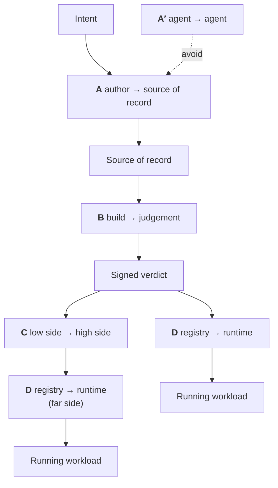

# The Hand-offs

Most boundaries inside a factory are ordinary function calls. Five of them are **trust-domain transitions**: the receiver cannot verify what the sender did by inspection, and must rely on a signature.

Those five are the architecture. Everything else is plumbing.

---

## A -- author to source of record

**What crosses:** a diff, plus a declaration of how it was made.

**The problem.** If an agent wrote it, the factory needs to know later, and no standard exists for recording that. The Linux kernel is the only serious precedent and it is a good one: an `Assisted-by: LLM <tools>` trailer, scrutiny proportional to how much was generated, and the hard rule that **agents must not add `Signed-off-by` because only a human can legally certify the Developer Certificate of Origin**.

**What the receiver checks:**

- a human in the DCO chain has signed off
- the `Assisted-by` trailer is present where generation was material
- mechanical checks that human review *cannot* perform have run

The GlassWorm malware used Unicode variation selectors that render as blank lines -- invisible in editors, in diffs, and in most static analysis, but executable to the interpreter. **Human review is not a detection control against adversarial content.**

!!! quote "Split the two jobs and stop conflating them"
    **Machines detect.** Unicode normalisation, invisible-character detection, licence and snippet scanning, reachability analysis, tests, policy evaluation. All mechanical, all attestable.

    **Humans are accountable.** A named person asserts they understand the change and will defend it.

    Neither substitutes for the other. The attestation at this boundary should record **both** -- what was checked mechanically, and who accepted what was left.

!!! danger "This is the only hand-off with no signed artefact anywhere in open source"
    A survey of 24 component slots found that everything available either *configures* review rules or *reports* on them. **Nothing signs "policy X was met for commit Y."**

    Which is awkward, because under heavy AI authorship this is the transition that becomes the integrity boundary -- see [AI: Capability vs Provability](../tradeoffs/ai.md).

## A′ -- agent to agent

**Keep agents as leaves.** Don't build a multi-agent delegation chain inside the factory core.

Two reasons:

**Attribution laundering.** A chain destroys the link between a change and an accountable identity. If agent A asked agent B to ask agent C, and C made the edit, the trailer says nothing useful and no human is in the loop at the point the decision was made.

**False independence.** "Independent" verifying agents collapse to very few genuinely corruption-distinct domains -- same model family, same prompt lineage, same tool outputs. Redundancy buys much less than the agent count suggests.

## B -- build to judgement

**What crosses:** an artefact digest plus an evidence set.

**The problem.** The evidence comes from several parties with different trustworthiness, and the gate must not confuse them.

| Document | Signed by |
|---|---|
| Build provenance, SBOM | Build platform key (unreachable from build steps) |
| Scan results | Scanner identity |
| VEX | VEX-issuer identity |
| Test results | Test task identity |
| **The verdict** | **Gate identity** |
| Release approval, image signature | Release authority |

Separate identities, decided once, painful to retrofit. If one key signs all of them the verdict means nothing.

**What the receiver checks:** every document binds to the artefact by `subject[].digest`; the signer matches the expected signer for that document type; external build parameters are **allowlisted** rather than denylisted; and the build's task references match a pre-approved trusted-task list.

!!! tip "The highest-value gate rule, and the one most factories omit"
    `trusted_task` -- comparing the task references in the provenance against a list of approved tasks. It's the difference between *"we have provenance"* and *"we have provenance that the build only ran steps we approved."*

**The output:** a signed verdict. From here on, nothing re-reads the evidence set in the hot path.

## C -- low side to high side

**What crosses:** a single file, through a boundary that may refuse it.

This is the hard one, and the one most commonly described wrongly. Two distinct cases:

=== "Media gap (sneakernet)"

    **Largely solved, contrary to what this project originally claimed.** A standard OCI layout carries images, signatures, attestations, SBOMs and the referrers graph. Hauler does this by default; `zarf package verify` performs full offline verification with a trust root embedded in the binary.

    **What's missing is the obligation to look.** Hauler's receiving-side `load` command has one flag and no verification. Zarf's deploy-time `--verify` defaults to `if-possible`. The buildable thing is a **fail-closed gate over a signed shipment manifest** -- stating what the transfer should contain, who authorised it, and what sequence number it carries.

=== "Guard-mediated (cross-domain)"

    **Genuinely unsolved.** A guard enforces content policy and may *transform* data to sanitise it. Transformation changes bytes, and changed bytes break every signature over them.

    The design response is a **two-control-point split**:

    1. A **low-side structural inspector** that expands each blob in a scratch area under recursion and expansion limits, rejects path escapes, device nodes, FIFOs, sockets, setuid and setgid bits and capability attributes, and **emits only a verdict -- never modified bytes**.
    2. A **high-assurance control point** kept single-function: schema validation plus confirming each blob's name equals its own hash.

    The payload is a flat content-addressed blob store plus one small strictly-schema'd signed manifest, so the high-assurance check needs no understanding of OCI, Helm or ELF.

    Full reasoning in [Integrity vs Inspection](../tradeoffs/integrity-vs-inspection.md).

**What the receiver checks, in order:** schema → manifest signature against a trust root that travelled *inside* the bundle → `sequence` against a stored high-water mark → per-blob hash equality. Evidence beyond that is additional verification at leisure, so provenance-rich checks **degrade gracefully instead of blocking deployment**.

!!! warning "Be honest about where trust terminates"
    If anything was transformed, or the far side cannot reach the near side's signing infrastructure, trust terminates at the importer rather than the original builder. Say so in the architecture document instead of implying an unbroken chain.

## D -- registry to runtime

**What crosses:** an image digest.

**What the receiver checks:** a signature and a verdict. Nothing else. Cheap, local, unbypassable, inside a webhook's time budget.

This is the easy one *because* B and C did the work. If admission control is doing anything expensive, the design has already failed upstream.

---

## Two rules that fall out of the whole picture

**The gate must live where the tenant cannot edit it.** Stated plainly by a practitioner describing a real deployment: *"developers have access to this Jenkinsfile."* A gate defined in the repository it is gating is not a gate.

**Count your trust-domain transitions and keep the number at five.** Each one needs a key, a policy, an audit trail and an honest sentence about what it delegates. Adding a sixth because it seemed architecturally tidy is how the operational burden becomes the reason the thing gets switched off.
