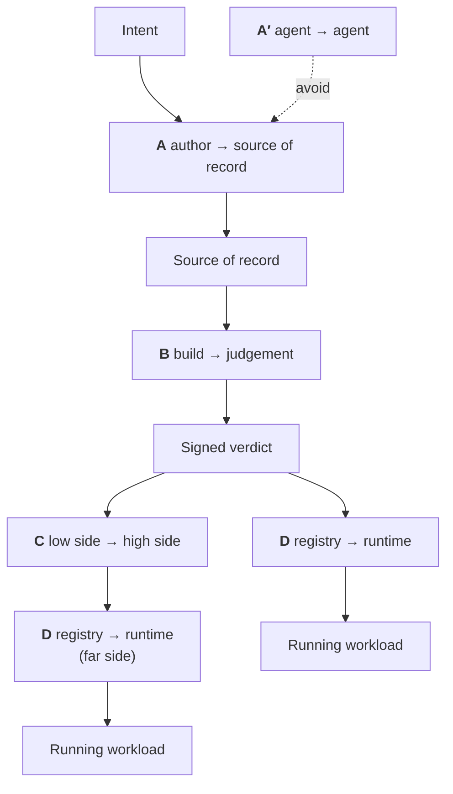

# The Hand-offs

Most boundaries inside a factory are ordinary function calls. A few are **trust-domain transitions**, where the receiver's only evidence about what the sender did is a signature. I count five.

---

## A -- author to source of record

**What crosses:** a diff, plus a declaration of how it was made.

**The problem.** If an agent wrote it, the factory needs to know later, and there's no standard for recording that. The nearest precedent is the Linux kernel's: an `Assisted-by: LLM <tools>` trailer, scrutiny proportional to how much was generated, and the hard rule that **agents must not add `Signed-off-by` because only a human can legally certify the Developer Certificate of Origin**.

**What the receiver checks:**

- a human in the DCO chain has signed off
- the `Assisted-by` trailer is present where generation was material
- the machine-only checks have run

The GlassWorm malware used Unicode variation selectors that render as blank lines in editors and diffs, slip past most static analysis, and reach the interpreter as executable code.

**Machines detect:** Unicode normalisation, invisible-character detection, licence and snippet scanning, reachability analysis, tests, policy evaluation. **Humans are accountable:** a named person asserts they understand the change and will defend it. The attestation at this boundary should record both: what was checked mechanically, and who accepted what was left.

!!! danger "Nothing in open source signs this hand-off"
    Across 24 component slots, everything I found either *configures* review rules or *reports* on them. Nothing signs "policy X was met for commit Y."

    Under heavy AI authorship this is the transition that becomes the integrity boundary -- see [AI: Capability vs Provability](../tradeoffs/ai.md).

## A′ -- agent to agent

**Keep agents as leaves.** What goes wrong inside a multi-agent delegation chain:

**Attribution laundering.** If agent A asked agent B to ask agent C, and C made the edit, the trailer says nothing useful and no human was in the loop at the point the decision was made.

**False independence.** "Independent" verifying agents collapse to very few genuinely corruption-distinct domains (same model family, same prompt lineage, same tool outputs). The agent count overstates the redundancy you have, and I've got no way to say by how much.

## B -- build to judgement

**What crosses:** an artefact digest plus an evidence set.

**The problem.** The evidence comes from several parties with different trustworthiness, and the gate must not confuse them.

| Document | Signed by |
|---|---|
| Build provenance, SBOM | Build platform key (unreachable from build steps) |
| Scan results | Scanner identity |
| VEX | VEX-issuer identity |
| Test results | Test task identity |
| **The verdict** | **Gate identity** |
| Release approval, image signature | Release authority |

Separate identities, decided once and painful to retrofit -- one key signing all of them makes the verdict mean nothing.

**What the receiver checks:** every document binds to the artefact by `subject[].digest`; the signer matches the expected signer for that document type; external build parameters all appear on an explicit **allowlist**; and the build's task references match a pre-approved trusted-task list.

!!! tip "The gate rule most often left out"
    `trusted_task` -- comparing the task references in the provenance against a list of approved tasks. Without it, the provenance tells you a build happened and says nothing about which steps ran.

**The output:** a signed verdict. From here on, nothing re-reads the evidence set in the hot path.

## C -- low side to high side

**What crosses:** a single file, through a boundary that may refuse it.

Most descriptions run two cases together:

=== "Media gap (sneakernet)"

    **Mostly solved.** A standard OCI layout carries images, signatures, attestations, SBOMs and the referrers graph. Hauler does this by default; `zarf package verify` performs full offline verification with a trust root embedded in the binary.

    **What's missing is the obligation to look.** Hauler's receiving-side `load` command has one flag and no verification, and Zarf's deploy-time `--verify` defaults to `if-possible`. The buildable thing is a **fail-closed gate over a signed shipment manifest** (stating what the transfer should contain, who authorised it, and what sequence number it carries).

=== "Guard-mediated (cross-domain)"

    **Still unsolved.** A guard enforces content policy and may *transform* data to sanitise it. Transformation changes bytes, and changed bytes break every signature over them.

    The design response splits the work across two control points:

    1. A **low-side structural inspector** that expands each blob in a scratch area under recursion and expansion limits, rejects path escapes, device nodes, FIFOs, sockets, setuid and setgid bits and capability attributes, and **emits a verdict as its only output, leaving every byte it expanded behind on the low side**.
    2. A **high-assurance control point** kept single-function: schema validation plus confirming each blob's name equals its own hash.

    The payload is a flat content-addressed blob store plus one small strictly-schema'd signed manifest, so the high-assurance check needs no understanding of OCI, Helm or ELF.

    I haven't found a working deployment to check the split against, so it rests on reasoning and nothing stronger. Full argument in [Integrity vs Inspection](../tradeoffs/integrity-vs-inspection.md).

**What the receiver checks, in order:** schema → manifest signature against a trust root that travelled *inside* the bundle → `sequence` against a stored high-water mark → per-blob hash equality. Evidence beyond that is additional verification at leisure: a provenance-rich check that cannot complete **degrades gracefully**, and deployment proceeds on the four checks above.

!!! warning "Trust terminates at the importer"
    If anything was transformed, or the far side cannot reach the near side's signing infrastructure, everything downstream rests on the importer's judgement about what it accepted. Name the importer in the architecture document as the party the far side relies on.

## D -- registry to runtime

**What crosses:** an image digest.

**What the receiver checks:** a signature and a verdict. Nothing else -- local, unbypassable, inside a webhook's time budget.

D is cheap because B and C did the work.

---

## What falls out

**The gate must live where the tenant cannot edit it.** A practitioner describing a real deployment: *"developers have access to this Jenkinsfile."*

**Each trust-domain transition needs a key, a policy, an audit trail and an honest sentence about what it delegates.** Adding one because it seemed architecturally tidy is how the operational burden becomes the reason the thing gets switched off.

Questions for your own factory:

- At A, who is the named human, and what did they accept?
- At C, if a guard transforms bytes, who is the importer that everything downstream rests on?
