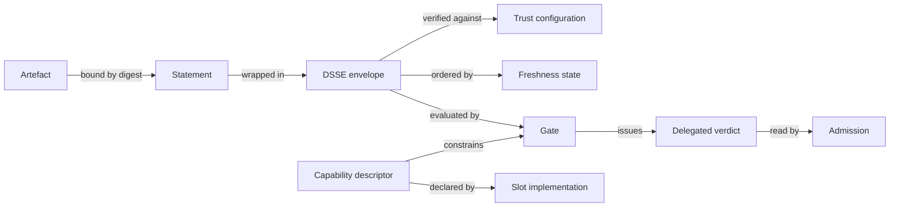

# The Five Primitives

Supply-chain integrity, cross-domain transfer, deployment composition and the AI layer read as separate problems. They seem to converge on the same small set of mechanisms.

Strip the domain language away and the same five building blocks keep coming back. Every hand-off I've traced is assembled from them, and I haven't needed a sixth yet.

---

## 1. The digest-bound statement

A small signed document that commits to a large thing by cryptographic hash, carrying a declared type.

In practice that means a DSSE envelope, wrapping an in-toto Statement, with a `predicateType` URI and a `subject[].digest`. The signature covers a pre-authentication encoding of the payload and its type together. Binding the type into the signed bytes is what defeats the type-confusion attacks that plagued ad-hoc JSON signing.

```json
{
  "_type": "https://in-toto.io/Statement/v1",
  "subject": [{ "name": "app", "digest": { "sha256": "a1b2c3..." } }],
  "predicateType": "https://slsa.dev/provenance/v1",
  "predicate": { }
}
```

**Of the five, this is the one I'd call catastrophic to reverse.** Every signature ever issued is over that encoding, so changing the envelope invalidates every historical attestation and every verifier simultaneously.

!!! tip "The rule that follows"
    **Mint custom predicates freely. Never mint a custom envelope.** A non-standard predicate inside a standard envelope costs a little, locally, and can be migrated later; a non-standard envelope costs everything, permanently.

`test-result/v0.1`, `runtime-trace/v0.1` and `svr/v0.2` are registered already. Extend them.

## 2. The delegated verdict

An accountable party performs an expensive verification once and signs a cheap assertion that everything downstream reads in its place.

The same shape turns up in places that don't look related:

| Instance | Verifies | Downstream reads |
|---|---|---|
| **The policy gate** | Provenance shape, SBOM quality, scan results, hermeticity, trusted-task membership | One signed verdict |
| **The cross-domain importer** | The upstream chain, before a boundary that may break it | The importer's signature |
| **The human reviewer** | That the change is defensible | A sign-off in the commit |

Treat them as one pattern and you get one implementation, one key-management story, one audit format, and one honest sentence in the architecture document about where trust delegates. I haven't seen that pay off end to end anywhere, so for now it's an argument waiting on a track record.

What keeps it safe, as far as I can tell:

- **Record the digest of the policy** that produced the verdict, so a policy change detectably invalidates prior verdicts.
- **Record the model identity and capability-descriptor digest** where AI was involved, so a model swap invalidates prior verdicts the same way.
- **Accept only specific signer-verifier pairs.** If one key signs both the build provenance and the verdict, the verdict is worthless -- a compromised build can issue its own pass.

!!! warning "Where the expensive reasoning belongs"
    **Rich policy belongs at the gate. Admission control verifies a signature and a verdict, and nothing else.** Evaluating "did this build prefetch hermetically from an approved mirror" inside an admission webhook with a one-second budget, against attestations fetched over the network, is how you take a cluster down.

## 3. The capability descriptor

The implementation declares, machine-readably, which outcomes it can actually deliver, and the factory core reads that declaration and turns features off.

```yaml
slot: inference
implementation: litellm-proxy -> vllm
tier: self-hosted-open-weight
toolCalling: constrained       # native | constrained | prompted | none
structuredOutput: constrained  # enforced | constrained | prompted | none
outcomesEnabled:  [autocomplete, review, test-gen, single-file-change]
outcomesDisabled: [autonomous-multi-file-change, long-horizon-task]
lastMeasured: { suite: swe-bench-subset, score: 0.42, attestation: "sha256:..." }
```

This is how **degradation becomes a design decision**, declared in configuration and visible before anyone meets it in production. An assessor can audit a factory that says "in this enclave, autonomous multi-file change is disabled, and here is the measurement that justifies it". Hand that same assessor a blanket claim of uniform capability, let it flake once under load, and I'd expect every other claim in the document to come under suspicion.

!!! danger "Only measurement counts"
    The descriptor must carry **measured** capability -- last night's signed evaluation score -- because a hand-maintained list of promises rots, and nothing in the system notices until someone relies on it.

## 4. Trust configuration

The set of keys, roots, revocations and validity windows a verifier needs to check anything at all.

Easy to overlook because in a connected environment it's ambient: your verifier reaches a transparency log, a certificate authority, a revocation endpoint. Remove the network and it becomes **payload** -- something that must travel with the artefact, be versioned, and be rotatable.

What it comprises:

- the current trust root, plus **the full chain of previous roots**, so a verifier offline for three years can walk forward to the present
- per-instance validity windows, because a signature made in the past must still verify -- so the trust configuration accumulates, keeping every entry it has ever carried
- a revocation set with an explicit issue time, and a stated policy that anything newer than that time carries the status *unknown*

The Update Framework solved rotation: new root metadata signed by a threshold of the old root's keys, walkable offline with no network. Ship the whole chain every time.

**Bootstrap is the problem that rotation machinery leaves open.** The first trust root has to arrive out of band (courier, two-person integrity, a fingerprint read over an authenticated voice channel, or embedded in an accredited binary). I can't see a way to close that gap with cryptography: a self-asserted root proves only that someone asserted it. So the first crossing looks to me like a trusted-process problem, and if that's right then the architecture document has to say so plainly -- a harder sentence to write than it sounds, which may be why I keep finding documents that leave it out.

## 5. Freshness and monotonicity state

Evidence about *when* and *in what order*, and the state a verifier keeps to detect omission and rollback.

Why I'd call this a primitive at all: a verifier with no memory can't detect that it was given an *old* valid bundle, or that a bundle was silently skipped. Both attacks require no forgery at all.

| Element | Prevents |
|---|---|
| `validNotBefore` / `validNotAfter` | Indefinite replay of a stale artefact |
| **`sequence`**, strictly monotonic per producer-destination pair | Rollback and omission |
| `supersedes` | Ambiguity about which of two valid bundles is current |
| High-water mark **retained by the receiver** | Everything above -- without this the other fields are decoration |
| Vulnerability-database version and timestamp | A scan verdict being read as current when its inputs were months old |

!!! quote "Why this seems unavoidable in a one-way architecture"
    You can't ask the far side what it already has. So the near side must **remember what it sent**, and the far side must **remember what it received**. Every one-way delta mechanism I've looked at turns out to be sender-side bookkeeping.

---

## The whole thing on one page



- Every arrow carries a **digest-bound statement**.
- The gate issues a **delegated verdict**, and so does the importer sitting on a boundary.
- Every box publishes a **capability descriptor**.
- Nothing verifies anything without **trust configuration** and **freshness state**.

## What this buys

If the five are fixed, the components should become close to interchangeable. Swapping Syft for Trivy ought to change which tool produces an SBOM attestation and reach no further -- the envelope, the binding, the discovery mechanism, the gate and everything downstream carrying on untouched. That's the prediction. It's cheap to test, which is why I'd start there if I wanted to find out where the five break down.

If it does hold, one architecture serves a hyperscale cloud and a disconnected enclave while staying one product. Whether it holds where you are comes down to questions I can't answer from here: is there a hand-off you're planning that needs something none of the five provide, and who owns the first trust root on the day it crosses into the enclave by hand?
