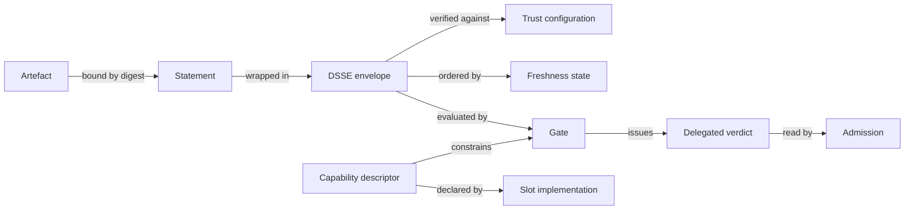

# The Five Primitives

Four different problems -- supply-chain integrity, cross-domain transfer, deployment composition and the AI layer -- converge on the same small set of mechanisms.

Strip the domain language away and there are five building blocks. Every hand-off in the factory is made from them.

---

## 1. The digest-bound statement

A small signed document that commits to a large thing by cryptographic hash, carrying a declared type.

Concretely: a DSSE envelope, wrapping an in-toto Statement, with a `predicateType` URI and a `subject[].digest`. The signature covers a pre-authentication encoding of the payload and its type together, never the raw payload -- which is what defeats the type-confusion attacks that plagued ad-hoc JSON signing.

```json
{
  "_type": "https://in-toto.io/Statement/v1",
  "subject": [{ "name": "app", "digest": { "sha256": "a1b2c3..." } }],
  "predicateType": "https://slsa.dev/provenance/v1",
  "predicate": { }
}
```

**This is the one choice that is catastrophic to reverse.** Every signature ever issued is over that encoding, so changing the envelope invalidates every historical attestation and every verifier simultaneously.

!!! tip "The rule that follows"
    **Mint custom predicates freely. Never mint a custom envelope.** A non-standard predicate inside a standard envelope costs a little, locally, and can be migrated. A non-standard envelope costs everything, permanently.

Three predicates are already registered and should be extended rather than reinvented: `test-result/v0.1`, `runtime-trace/v0.1`, and `svr/v0.2`.

## 2. The delegated verdict

An accountable party performs an expensive verification once and signs a cheap assertion that everything downstream trusts instead of repeating the work.

The pattern appears in three places that look unrelated:

| Instance | Verifies | Downstream reads |
|---|---|---|
| **The policy gate** | Provenance shape, SBOM quality, scan results, hermeticity, trusted-task membership | One signed verdict |
| **The cross-domain importer** | The upstream chain, before a boundary that may break it | The importer's signature |
| **The human reviewer** | That the change is defensible | A sign-off in the commit |

Recognising them as one pattern means one implementation, one key-management story, one audit format, and one honest sentence in the architecture document about where trust delegates.

Three rules make it safe:

- **Record the digest of the policy** that produced the verdict, so a policy change detectably invalidates prior verdicts.
- **Record the model identity and capability-descriptor digest** where AI was involved, so a model swap invalidates prior verdicts the same way.
- **Accept only specific signer-verifier pairs.** If one key signs both the build provenance and the verdict, the verdict is worthless -- a compromised build can issue its own pass.

!!! warning "Where the expensive reasoning must not live"
    Evaluating "did this build prefetch hermetically from an approved mirror" inside an admission webhook with a one-second budget, against attestations fetched over the network, is how you take a cluster down. **Rich policy belongs at the gate. Admission control verifies a signature and a verdict, and nothing else.**

## 3. The capability descriptor

The implementation declares, machine-readably, which outcomes it can actually deliver. The factory core reads it and turns features off.

```yaml
slot: inference
implementation: litellm-proxy -> vllm
tier: self-hosted-open-weight
toolCalling: constrained       # native | constrained | prompted | none
structuredOutput: constrained  # enforced | constrained | prompted | none
outcomesEnabled:  [autocomplete, review, test-gen, single-file-change]
outcomesDisabled: [autonomous-multi-file-change, long-horizon-task]
lastMeasured: { suite: swe-bench-subset, score: 0.42, attestation: "sha256:..." }
```

This is how **degradation becomes a design decision rather than a production surprise**. A factory that says "in this enclave, autonomous multi-file change is disabled, and here is the measurement that justifies it" is far more credible to an assessor than one claiming uniform capability that quietly flakes.

!!! danger "Declared is not good enough"
    The descriptor must carry **measured** capability -- last night's signed evaluation score -- not a hand-maintained list of promises. Otherwise it rots exactly like every other hand-written artefact.

## 4. Trust configuration

The set of keys, roots, revocations and validity windows a verifier needs to check anything at all.

Easy to overlook because in a connected environment it's ambient: your verifier reaches a transparency log, a certificate authority, a revocation endpoint. Remove the network and it becomes **payload** -- something that must travel with the artefact, be versioned, and be rotatable.

What it comprises:

- the current trust root, plus **the full chain of previous roots**, so a verifier offline for three years can walk forward to the present
- per-instance validity windows, because a signature made in the past must still verify -- so the trust configuration is cumulative, never replaced
- a revocation set with an explicit issue time, and a stated policy that anything newer is *unknown* rather than *valid*

The Update Framework solved rotation: new root metadata signed by a threshold of the old root's keys, walkable offline with no network. Ship the whole chain every time.

**What it cannot solve is bootstrap.** The first trust root has to arrive out of band (courier, two-person integrity, a fingerprint read over an authenticated voice channel, or embedded in an accredited binary). There is no cryptographic answer, because a self-asserted root is not a root. **The first crossing is a trusted-process problem, not a trusted-technology problem, and the architecture document must say so.**

## 5. Freshness and monotonicity state

Evidence about *when* and *in what order*, and the state a verifier keeps to detect omission and rollback.

Why a primitive rather than a field: a verifier with no memory can't detect that it was given an *old* valid bundle, or that a bundle was silently skipped. Both attacks require no forgery at all.

| Element | Prevents |
|---|---|
| `validNotBefore` / `validNotAfter` | Indefinite replay of a stale artefact |
| **`sequence`**, strictly monotonic per producer-destination pair | Rollback and omission |
| `supersedes` | Ambiguity about which of two valid bundles is current |
| High-water mark **retained by the receiver** | Everything above -- without this the other fields are decoration |
| Vulnerability-database version and timestamp | A scan verdict being read as current when its inputs were months old |

!!! quote "Why this is unavoidable in a one-way architecture"
    You can't ask the far side what it already has. So the near side must **remember what it sent**, and the far side must **remember what it received**. Every working one-way delta mechanism is sender-side bookkeeping.

---

## The whole thing on one page



- Every arrow carries a **digest-bound statement**.
- Two arrows issue a **delegated verdict** -- the gate, and the importer at a boundary.
- Every box publishes a **capability descriptor**.
- Every verification consults **trust configuration** and **freshness state**.

## What this buys

If the five are fixed, the components become nearly interchangeable. Swapping Syft for Trivy changes which tool produces an SBOM attestation; it doesn't change the envelope, the binding, the discovery mechanism, the gate, or anything downstream.

That's what makes one architecture serve a hyperscale cloud and a disconnected enclave without becoming two products.
